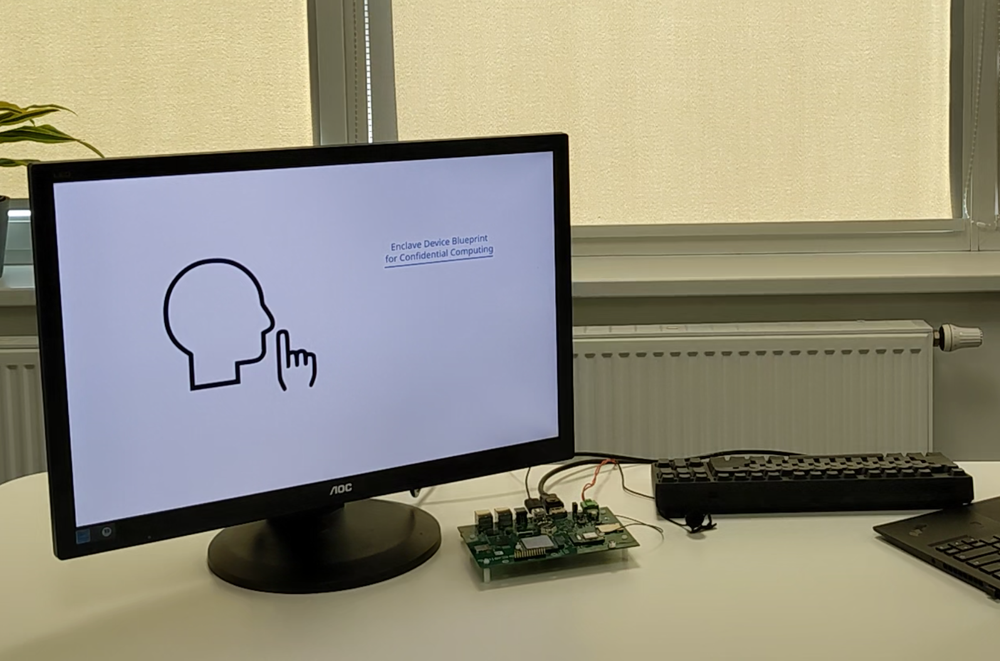

# Enclage Device Blueprint RealityAI demo

This demo performs a confidential machine learning inference on an edge device with the use of [Blueprint for a Confidential Computing at the Edge](https://github.com/Azure-Samples/Project_Confidential_Apps_for_IoT_with_Enclaves) using Reality AI.



The main function of the application is to perform an image classification
between key images ([Scalys](https://scalys.com), [Arm](https://www.arm.com) and [Microsoft](https://www.microsoft.com)). It can work
both in a single shot mode clasifying an image file and in a video stream capture mode.

The significance of this demo is a protection of a sensitive payload (in this case - ML model) using Confidential Computing Blueprint.

# Hardware platform

Demo setup consists of a [TrustBox Edge RZ/V2L](https://scalys.com/solutions/application-ecosystem/trustsys-rz/) monitor with DisplayPort connection and USB microphone. Though it also works on the other devices from the TrustBox Edge line.

Demo is built and tested with USB microphone "Boya BY-LM40". Potentially any generic
USB microphone should work, but other models may require tuning for the supported audio recording formats and reliable functioning is tested only on with the mentioned model. Other
microphones cameras may experience worse classification qualit.

# Build

Build is verified and tested on an Ubuntu 20.04 host system. For reprodution SDK with toolchain should be installed.

It also requires an ML learning workload generated using [Reality AI toolset](https://reality.ai).

## Build environment

To have a reproducible environment docker build environment from this project
can be used. To prepare and run it perform:
```
$ cd docker
$ make
```

To run a session witihn this environment:
```
$ docker/run-20.04.sh
```

## Toolchain

A successful build of this project requires a specific SDK to be used. Download it from
Scalys releases [here](http://trustbox.scalys.com/pub/openenclave/poky-glibc-x86_64-scalys-openenclave-image-aarch64-trustbox-rzv2l-toolchain-ext-3.1.19.sh) and install it via command:

```
$ chmod +x poky-glibc-x86_64-scalys-openenclave-image-aarch64-trustsom-toolchain-ext-3.1.10.sh
$ ./poky-glibc-x86_64-scalys-openenclave-image-aarch64-trustsom-toolchain-ext-3.1.10.sh
```

## Application bulid

*Note:* Reality AI generated model should be first generated and put into the project sources in `libs/realityai/libRealityAI.a` and `common/edb_rai_model.h`. For more info see [EDB demo guide](https://github.com/Scalys/edb-rai-demo/blob/main/docs/edb-demo-guide.md).

Source the toolchain:
```
$ source ~/poky_sdk/environment-setup-aarch64-poky-linux 
```

Create a build directory next to the downloaded edb RAI demo:
```
mkdir edb-rai-demo-build
cd edb-rai-demo-build
```

Configure and build the application:
```
$ cmake ../edb-rai-demo \
  -DPKG_CONFIG_SYSROOT_DIR="${PKG_CONFIG_SYSROOT_DIR}" \
  -DOE_TEE=OP-TEE \
  -DOE_PACKAGE_OPTEE_PLATFORM=trustsom \
  -DOE_OPTEE_PLATFORM=trustsom \
  -DCMAKE_TOOLCHAIN_FILE=../oeml/cmake/arm-cross.cmake\
  -DCMAKE_BUILD_TYPE=release \
  -DOE_PACKAGE_PREFIX=${PKG_CONFIG_SYSROOT_DIR}/opt/oe
$ make
```

The resulting build outputs are located at:
```
out/bin/c7198089-6313-4ba6-8e3c-47846520df18.ta
out/bin/edb_rai_demo
```

# Run

To run the demo manually on a device in a streamed mode:
```
# ./edb_rai_demo c7198089-6313-4ba6-8e3c-47846520df18.ta
```
A successful execution should print
```
Silence
Silence
Silence
...
```

The running application will also operate the currently recognized class display via changing symlinks for resources used by a running web server. Thus, if webserver is running, the image should be updating while `edb_rai_demo` is running.

For more details see `./edb_rai_demo --help`.

# Cloud management

For a one-button Azure cloud infrastructure deployment see this [page](https://github.com/Azure-Samples/Project_Confidential_Apps_for_IoT_with_Enclaves/blob/main/docs/azure-environment-setup.md).

# Confidential Package Management

For information on installing and using Confidential Packages see this [page](https://github.com/Scalys/ConfidentialPackageTools).


# Enclave Device Blueprint reference implementation

For instructions on preparing the TrustBox Edge RZ/V2L for a demo refer to the [setup guide](https://github.com/Scalys/edb-rai-demo/blob/main/docs/tberzv-setup.md)

For a full end-to-end Enclave Device Blueprint description, refer to the [EDB demo guide](https://github.com/Scalys/edb-rai-demo/blob/main/docs/edb-demo-guide.md)
